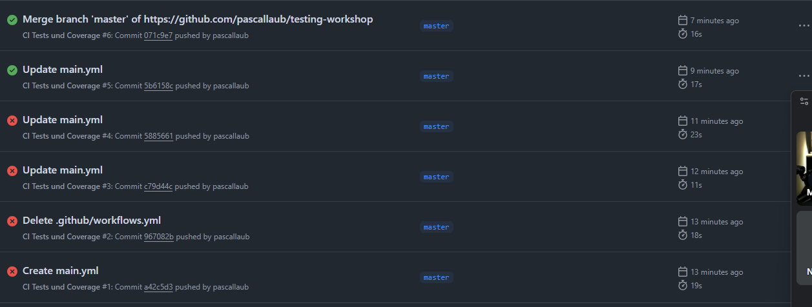

## Testing Coverage

## Entdeckte Fehler

# let finalScore war nicht deklariert
# Die strikte Validierung erfolgte erst nach der Prüfung der Grenzen
# Edge-Case sind genau an den Notengrenzen, um zu schauen ob dennoch die richtige Note kommt

## Reflexion TDD
# TDD kann in bestimmten Anwendungsfällen von Vorteil sein, besonders wenn man Fehler möglichst direkt "ausschließen" bzw. möglichst klein halten will. Auf der Anderen Seite macht es das Programmieren zusätzlich noch aufwändiger und verlangsamt somit evtl. den Fortschritt leicht. Es lässt sich also nicht pauschal sagen, dass TDD gut oder schlecht ist und es ist auf den speziellen Fall anzuwenden. 

## Screenshot Github Actions
